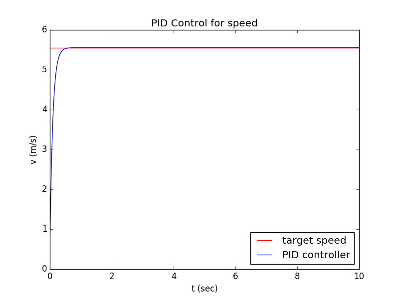
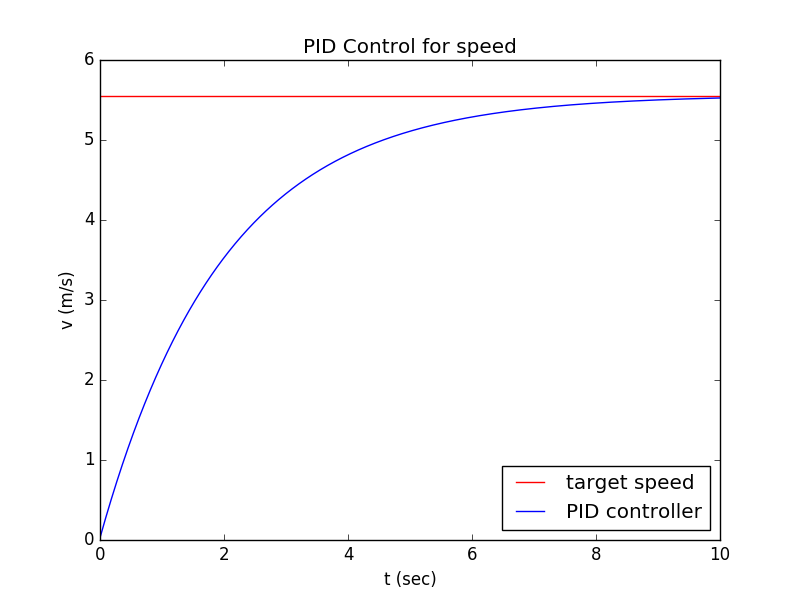

## [1기 정승균] Do not Collide 과제

<br>
<br>

### Ⅰ.  실행 런치파일 및 결과 영상 링크

---

#### 1. PID + Stanley + Frenet 시뮬레이션

* `$ roslaunch simul stanleysimul.launch`\
[](https://youtu.be/AKHuYRYmus0)

#### 2. PID + Pure Pursuit + Frenet 시뮬레이션

* `$ roslaunch simul ppsimul.launch`\
[](https://youtu.be/e6x0UKBfd3c)

<br>
<br>

### Ⅱ. Longitudinal Control

---

종방향 제어로 PID를 사용하였는데 사실 시뮬레이션상으로는 노이즈가 없어 P제어로도 충분하였다. 그 이유는 Kp 를 1/dt 로 두면 다음 step에서 목표 속도를 정확히 이룰 수 있기 때문이다. 
Kp를 이 값에 근접할수록 목표 속도에 더 빨리 도달한다.

다음은 dt를 0.01이고 Kp가 10인 경우의 속도 그래프이다.



하지만 실제로 차가 이렇게 주행한다면 급발진이나 다름없음으로 Kp를 0.5로 다소 낮게 설정하였다. 그렇게 하면 속도 그래프는 다음과 같다.



개선할 부분:
* 현재 속도에 대한 노이즈를 추가해서 실험해보기
* Frenet Path에서 target d 를 이용해서 path를 생성한 것처럼 현재 속도/가속도와 목표 속도/가속도를 가지는 reference velocity path를 구하기

<br>
<br>

### Ⅲ. Lateral Control

---

#### 1. Stanley Control

Stanley에서 steer angle를 제어하는 파라미터로는 주요 설정값 k과 저속 보정값 ks 와 고속 보정값 kd가 있고 아래와 같이 계산된다.

```python
yaw_term = self.normalize_angle(map_yaw - yaw)
cte_term = np.arctan2(self.k*cte, v + self.ks)

steer = yaw_term + cte_term + self.kd* (yaw_term-self.prev_yaw_term)/dt
```
하지만 야심하차게 준비한 ks 와 kd는 딱히 이번 시뮬레이션에서는 크게 활용할 일이 없었다. 사실 k값마저도 운이 좋은건지 딱히 튜닝을 하지 않았는데도 잘 주행하였다.

<br>

#### 2. Pure Pursuit

들은대로 아주 구현이 쉬워서 20줄로도 제어 클래스를 코딩하는것이 가능하였다. 딱히 뭐가 없는만큼 성능도 별로일거라고 생각하였지만 시뮬레이션상으로는 생각보다 안정적이였다.
파라미터도 lookahead distance를 설정하는 k, ks 밖에 없었다.
```
look_dist = self.k * v + self.ks
```
저속일때 lookdistance가 너무 작아지는 것을 방지하기 위한 ks 값은 혹시나 필요할까봐 넣었는데 필요가 없었다. k 값이 1.2를 넘어가면 장애물에 출동할 확률이 늘어났고 극단적으로 작은 값만 아니라면 시뮬레이션이라 그런지 잘 주행하였다.

<br>
<br>

### Ⅳ. Frenet Optimal Path Planning

---

사실 여기에 있던 코드들은 거의 다 갈아 엎었는데 주요 변경점은 다음과 같다.
1. s-t 함수와 d-t 함수를 따로 구하여 합치는 대신 처음부터 s-d 함수를 구하는 것으로 하였다. 이렇게 한 이유는 제어는 어짜피 위에 설명한 controller들이 하기 때문에 trajectory가 아닌 path를 찾는것만으로도 충분하기 때문이다. 더 간단해지고 덤으로 연산도 빨라진다.
2. 1번의 변경점으로 인해 cost function도 변경하였다. 고려하는 값들은 다음과 같다.
    * 전 경로의 목표 d 값과의 새로운 경로의 d 값의 차이인 d_diff : 일관성 유지를 위함
    * 경로의 평균곡률인 mean_kappa : 급커브 방지하기 위함
    * 경로와 장애물과의 최소 거리 gap : 장애물 더 여유롭게 회피하기 위함
    * 경로의 총거리인 path_sum : 최단거리로 가기 위함
3. get_frenet에서 최단거리의 점을 찾기 위한 검색범위를 제한하였다. 전의 위치를 고려해서 일정한 index 차이가 이하의 점들 중에서 최단거리의 점을 찾도록 하여 속도를 높일 수 있고 교차로나 인접해 있는 다른 경로에서 이탈하는 일이 없도록 하였다.

주어진 지도에서 차선이 2개밖에 없고 차 너비가 차선의 너비와 비슷하므로 목표 d의 선택이 폭이 넓지 않았다. 도로 정중앙값, 각 차선의 중앙값, 장애물이 있을시 차선을 밟더라도 피하기 위한 값 총 5개의 값을 설정하였다.

개선할 점
* 시뮬레이션에서는 장애물이 많아 문제가 크진 않았지만, 장애물 조우시 한번 차선 끄트머리에 간 후로 다시 차선 중앙에 안돌아오는 것을 방지해 차선 중앙에서 벗어난 것에 대한 cost도 추가하면 좋을 것 같다.


<br>
<br>


### Ⅴ. stanleysimul / ppsimul 코드 흐름 

---

* 모델이나 Controller같은 큼직한 것들은 다른 곳에 모듈로 옮겨놓아 import 함

<br>

#### 1. Obstacles / Path 설정

```python
######## load reference path ########

rospack = rospkg.RosPack()
path = rospack.get_path("map_server")

with open(path + "/src/ref_path.pkl", "rb") as f:
    ref_path = pickle.load(f)


######## load obstacles info ########

path = rospack.get_path("obstacles")

with open(path + "/src/obstacles.pkl", "rb") as f:
    obstacles = pickle.load(f)
xy, yaw = np.hsplit(obstacles, [2])
yaw = np.column_stack([np.cos(yaw), np.sin(yaw)])
obstacles = np.vstack([xy -1.4*yaw, xy +1.4*yaw])
```

* 기존 reference path를 합쳐서 pickle로 저장하여 편하게 로드할 수 있도록 함
* obstacle의 좌표는 refrence path의 일정 s좌표마다 d좌표값을 +- 1 씩 주어 Frenet의 get_cartesian으로 변환하여 얻음
* 이 좌표는 장애물의 중앙에 대한 값이므로  더 엄밀한 탐지를 위하여 yaw값을 사용하여 양끝의 값을 얻음

<br>

#### 2. 목표 설정

---

```python
######## Target ########

target_speed = 20.0 / 3.6
start_x, start_y, start_yaw = ref_path["x"][30], ref_path["y"][30], ref_path["yaw"][30]
target_x, target_y = ref_path["x"][430], ref_path["y"][430]
```

* 목표 속도는 주어진 대로 20km/h ≒ 5.56 m/s 로 설정
* 시작 위치는 reference path의 30번째 지점으로 설정
* 목표 위치는 reference path의 430번째 지점으로 설정

<br>

#### 3. 인스턴스 생성

---

```python
######## Instances ########

# Marker Converter
path2marker = PathMarker()
paths2markerarray = PathsMarkerArray()
text2marker = TextMarker()

# driving car instance
car = KinematicBicycle(start_x, start_y, start_yaw)

# publishers
car.init_marker_pub(topic="driving", frame_id="map", ns="driving", id=1)
car.init_odom_pub(name="odom", child_frame_id="car1", frame_id="map")
paths_pub = rospy.Publisher("paths", MarkerArray, queue_size=1)

# controller instance
longitudinal_controller = PID_Controller(Kp=0.5, Kd=0, Ki=0.0003)
lateral_controller = Stanley(k=0.8, ks=0.5, kd=0, L=2.8)

# path finding instance
path_finder = Frenet(ref_path, start_x, start_y, start_yaw)
```

* Marker Converter들은 marker를 쉽게 생성해주는 객체. 예를 들어 PathMarker의 경우 FrenetPath 객체를 Marker로 변환해준다.

* 자율주행하는 차는 KinematicBicycle 모델을 사용하였다.

* KinematicBicycle 객체안에 내부적으로 현재 상태를 odom이나 marker를 발행할 수 있도록 하였고 이를 활성화하였다.

<br>

#### 4. Main 

---

```python
######## Main ########
rate = rospy.Rate(10)

while not rospy.is_shutdown():

    # find optimal path from Frenet
    paths, optimal_path = path_finder.find_path(car.x + car.L * np.cos(car.yaw), car.y + car.L * np.sin(car.yaw), obstacles)
    ma = []
    if optimal_path:
        ma.append(paths2markerarray.convert(paths))
        ma.append(path2marker.convert(optimal_path))
```

* 집 컴퓨터가 느리므로 rate을 10으로 변경 (기존: 100).
* path_finder 객체의 find_path 메소드로 차 위치 정보와 장애물 정보를 토대로 가능한 경로들 paths와 최적의 path인 optimal_path 계산
  * Stanley의 경우 차 앞바퀴쪽 위치 정보를 사용
  * PurePursuit의 경우 차 뒷바뀌쪽 위치 정보를 사용
* 존재하면 MarkerArray 에 담음

<br>

```python
    # update car
    ai = longitudinal_controller.feedback(car.v - target_speed, 0.1)
    if optimal_path:
        di = lateral_controller.feedback(car.x, car.y, car.yaw, car.v, optimal_path.x, optimal_path.y, optimal_path.yaw)
    else:
        di = lateral_controller.feedback(car.x, car.y, car.yaw, car.v, ref_path["x"], ref_path["y"], ref_path["yaw"])
    car.update(ai, di)
    ma.append(text2marker.convert("speed : %.2f" %car.v, 5))
```

* pid로 error = 현재속도-목표속도, dt=0.1 로 하여 가속도 ai를 구함
* optimal_path가 존재하면 그 경로를 바탕으로 lateral_controller로 조향각 di를 구함
* 존재하지 않으면 기존 경로를 바탕으로 lateral_controller를 사용. 실제로는 멈추거나 그래야겠지만 디버깅 목적으로 이렇게 설정하였다.
* 차의 현재 속도를 나타내는 TextMarker 생성. 사실 별 필요성은 없는데 Text Marker라는 것이 있길래 신기해서 한번 넣어보았다.

<br>

```python
    # check if near target
    if np.hypot(car.x - target_x, car.y - target_y) < 3 :  
        car.x, car.y, car.yaw, car.v, car.a = start_x, start_y, start_yaw, 0, 0
        path_finder.reset(start_x, start_y, start_yaw)
```
*  현재 차의 위치와 목표 위치가 가까우면 초기화

<br>

```python
    # publish car / paths / ui for visualization
    car.publish_marker()
    car.publish_odom()
    paths_pub.publish(ma)

    rate.sleep()
```

* 목표 지점이 아니면 발행할것들 발행하고 sleep